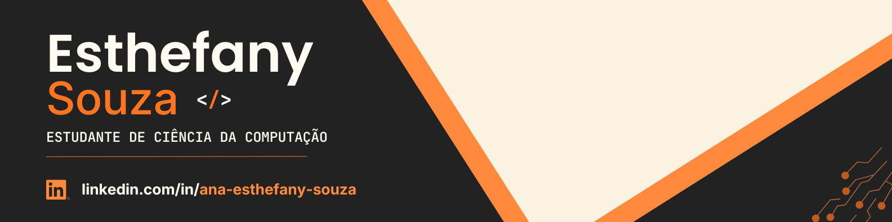

# Sejam bem-vindos! 👋

Apaixonada por tecnologia, programação e por transformar ideias em soluções!

Sempre aprendendo, sempre construindo. 🚀

## 🔗 Contatos

   
  

---

## 💻 Tecnologias e Linguagens

### Domínio

  

### Estudando

  

---

## 🛠️ Ferramentas

  
  
  
  
  
  
  

---

## 🚀 Em Destaque

- Desenvolvimento Web
- Interfaces modernas e responsivas
- Aprendizado contínuo
- Construção de projetos práticos

---

> Code. Learn. Build.!

---
